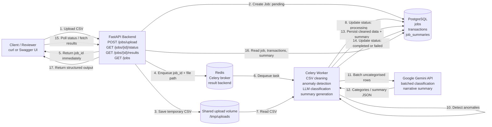

# System Design Diagram

## Request Lifecycle

1. The reviewer uploads `transactions.csv` to `POST /jobs/upload`.
2. FastAPI validates the file, stores it temporarily, creates a `jobs` row with `pending` status, and pushes a Celery task to Redis.
3. The Celery worker dequeues the job, marks it `processing`, loads the CSV, cleans dirty values, removes duplicates, and detects anomalies.
4. Missing categories are sent to Gemini in batches, not one request per row.
5. The worker asks Gemini for a summary JSON, then persists cleaned transactions and the job summary in PostgreSQL.
6. The reviewer polls `/jobs/{job_id}/status` and retrieves `/jobs/{job_id}/results` once completed.

## Scale Notes

- At 100x traffic, pressure points are upload disk I/O, Celery queue depth, PostgreSQL connection pool limits, and Gemini API rate limits.
- Next iteration: object storage for uploads, horizontally scaled workers, managed Redis/PostgreSQL, idempotent task retries, LLM rate-limit backoff queues, and API authentication.
